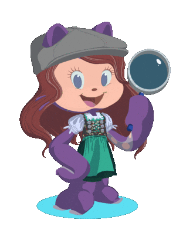

Привет! Меня зовут Настя, и я QA Engineer     Моя миссия — находить и разоблачать ошибки, скрывающиеся в ПО. 

В этом досье собраны материалы о проведённых расследованиях в мире тестирования. Анализ улик (требований и макета), постановка экспериментов (чек-листы, тест-кейсы) и составление детального отчёта о раскрытых преступлениях (баг-репортов) — всё здесь.

Загляните ниже, если хотите увидеть, как баги попадают в поле зрения QA-детектива!

## О детективе:

&nbsp;&nbsp;&nbsp;&nbsp;&nbsp;
 **Образование:** высшее в сфере IT 

&nbsp;&nbsp;&nbsp;&nbsp;&nbsp;
 **Квалификация:** окончила курс ["Функциональное тестирование ПО"](https://rusau.net/qa-from-scratch)

&nbsp;&nbsp;&nbsp;&nbsp;&nbsp;
 **Специализация:** тестирование WEB и мобильных приложений

&nbsp;&nbsp;&nbsp;&nbsp;&nbsp;
 **Материалы:** мое резюме

&nbsp;&nbsp;&nbsp;&nbsp;&nbsp;
 **Вне службы:** люблю разгадывать детективные загадки  и танцевать  

&nbsp;

## Арсенал QA-детектива
Каждому сыщику нужны надежные инструменты для раскрытия преступлений в ПО. В моем арсенале есть всё, чтобы вывести баги на чистую воду.

&nbsp;
&nbsp;
&nbsp;
&nbsp;

  <table style="text-align: right;"> 
    <tr>
      <td>Тестовая документация</td>
      <td>
        
        
        
        
        
        
      </td>
    </tr>
    <tr>
      <td>Тестирование веб-приложений</td>
      <td>
        &nbsp;
        &nbsp;
        
      </td>
    </tr>
    <tr>
      <td>Тестирование мобильных приложений</td>
      <td>
        &nbsp;
        &nbsp;
        &nbsp;
        &nbsp;
        
      </td>
    </tr>
    <tr>
      <td>Работа с данными</td>
      <td>
        &nbsp;
        
      </td>
    </tr>
    <tr>
      <td>Работа с кодом</td>
      <td>
        &nbsp;
        &nbsp;
        
      </td>
    </tr>
  </table>

&nbsp;
&nbsp;
&nbsp;
&nbsp;
&nbsp;
&nbsp;
&nbsp;

## Материалы расследований (Тестовые артефакты)
В этом разделе собраны материалы, которые помогли вывести баги на чистую воду.

 

&nbsp;&nbsp;&nbsp;&nbsp;&nbsp;
  [Тестирование веб-приложений](https://github.com/NikolaevaAR/web)

&nbsp;&nbsp;&nbsp;&nbsp;&nbsp;
 [Тестирование REST и SOAP API через Postman](https://github.com/NikolaevaAR/api)

&nbsp;&nbsp;&nbsp;&nbsp;&nbsp;
 [Работа с базами данных (MySQL, MongoDB)](https://github.com/NikolaevaAR/database)

&nbsp;&nbsp;&nbsp;&nbsp;&nbsp;
 [Тестирование мобильных приложений](https://github.com/NikolaevaAR/mobile)

&nbsp;&nbsp;&nbsp;&nbsp;&nbsp;
 [Перехват и изменение трафика](https://github.com/NikolaevaAR/traffic)

&nbsp;&nbsp;&nbsp;&nbsp;&nbsp;
 [Работа с Bash](https://github.com/NikolaevaAR/bash)

&nbsp;&nbsp;&nbsp;&nbsp;&nbsp;
 [Работа с Git](https://github.com/NikolaevaAR/git) 

&nbsp;

## Свяжитесь с QA-детективом

  

    
    
  

  &nbsp;

